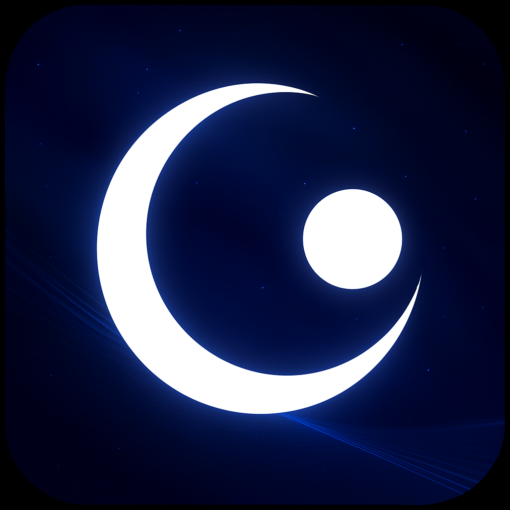

<div align="center">
   <a href="https://github.com/notserp-dev/Umbra">
      
   </a>
   <h1 align="center">Umbra</h1>
   <p align="center">
      A next-generation mod menu for Geometry Dash — a modern fork of the Eclipse project.
   </p>
</div>

<div align="center">
    <a href="https://github.com/notserp-dev/Umbra/latest">
          
    </a>
    
    
    <a href="LICENSE.md">
      
    </a>
    <a href="https://github.com/notserp-dev/Umbra/issues">
      
    </a>
</div>
<br>

## Tabbed Style


## Cocos UI


## Panel Style 


## Sidebar Style 


## How to Install
Since Umbra is not available in the Geode Library yet, you must install it manually.

1. Install [Geode](https://geode-sdk.org) if you haven't already.
2. Download the latest Umbra release from the **Releases** section of this repository.
3. Locate your Geometry Dash **mods** folder:
- **Windows:** `%localappdata%/GeometryDash/geode/mods`
- **macOS:** `~/Library/Application Support/GeometryDash/geode/mods`
- **Android:** `/Android/data/com.robtopx.geometryjump/geode/mods` (path may vary)
4. Place the downloaded `.geode` file into the **mods** folder.
5. Launch Geometry Dash — Geode will automatically load Umbra!

## How to Use
1. On PC, press `TAB` to toggle the mod menu.
2. Enable, disable, or customize any hack/module.
3. For help or support, join our community Discord server!
4. Enjoy exploring Umbra’s expanded features.

## Features
- 100+ hacks inherited from Eclipse and extended further
- StartPos Switcher (including Smart StartPos)
- Fully customizable labels
- Show Trajectory
- Internal Recorder
- Replay Bot
- Keybinds system
- Theme customizability
- Cross‑platform support (Windows, macOS, Android)
- Translation support
- API for mod developers to integrate with Umbra

## Build Instructions
You will need: `CMake`, `MSVC / Clang`, `Git`, `Geode CLI`, `Geode SDK`

```bash
git clone https://github.com/notserp-dev/Umbra
cd Umbra
cmake -B build -DCMAKE_BUILD_TYPE=RelWithDebInfo
cmake --build build --config RelWithDebInfo
```

## Credits
Umbra is built on top of the Eclipse project — huge thanks to the original Eclipse developers:
- [ninXout](https://github.com/ninXout) – Crystal Client
- [prevter](https://github.com/Prevter) – OpenHack
- [maxnut](https://github.com/maxnut) – GD Mega Overlay
- [Firee](https://github.com/FireMario211) – Prism Menu
- [SpaghettDev](https://github.com/SpaghettDev)

## License
**Umbra** is released under the **Eclipse Public License v2.0**, inherited from the original Eclipse project.
